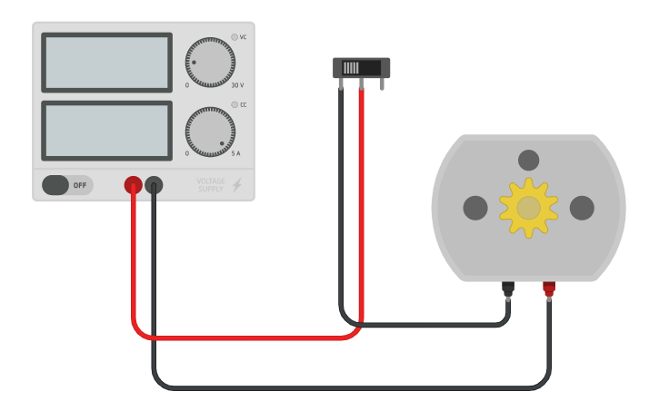

# SPD PARTE 3
# Oliveira Santiago - 40393965

# ARDUINO

## Integrantes 
- Santiago Oliveira

## Descripción
Suma,resta y reinicia (con un motor) un contador, el cual se mostrará en dos displays de 7 segmentos 
Prende una lampara según la temperatura
Prende un led según la luz ambiental

# Funciones principales
~~~ C (lenguaje en el que esta escrito)

/*
sumar()
Delay de 3 milisegundos
Suma en uno al contador
retorno: void
*/
void sumar(){
  delay(300);
  cont++;
  Serial.println(cont);
}

/*
restar()
Delay de 3 milisegundos
Resta en uno al contador
retorno: void
*/
void restar(){
  delay(300);
  cont--;
}

/*
reiniciar()
Delay de 3 milisegundos
Enciende el motor y mientras esté encendido, resta el contador hasta que llegue a 0 y apaga el motor.
retorno: void
*/
int reiniciar(int cont){
 
  digitalWrite(motor,HIGH);
  int resultado = digitalRead(motor);
  
  if(resultado == HIGH){
    for(cont; cont>0;cont--){
    delay(10);
  	analogWrite(motor,cont);
	Serial.println(cont);
   }
  }
  digitalWrite(motor,LOW);
  return cont;
  
}

/*
obteterDecena(int cont)
param: int cont
Calcula la decena de un numero y la retorna
retorno: int
*/
int obtenerDecena(int cont){
  	decena = (cont / 10) % 10;
    return decena;
  }

/*
obtenerUnidad(int cont)
param: int cont
Calcula la unidad de un numero y la retorna
retorno: int
*/
int obtenerUnidad(int cont){
  unidad = cont % 10;
  return unidad;
}

/*
esPrimo(int numero)
param: int numero
Analiza el numero pasado por parametro y retorna un booleano en caso 
de que sea o no un numero primo matemático
retorno: boolean
*/
bool esPrimo(int numero) {
    if (numero <= 1) {
        return false;
    }
    if (numero <= 3) {
        return true;
    }
    if (numero % 2 == 0 || numero % 3 == 0) {
        return false;
    }
    for (int i = 5; i * i <= numero; i += 6) {
        if (numero % i == 0 || numero % (i + 2) == 0) {
            return false;
        }
    }
    return true;
}
~~~

## Motor CC

Un motor CC en Arduino es un tipo de motor eléctrico que gira cuando le das electricidad, y cambia de dirección de giro cuando se invierta la electricidad. Es muy útil en proyectos de robots y automatización controlados con Arduino.
Podría utilizarle en:
1) Robótica: Para mover las ruedas de un robot o controlar sus movimientos.
2) Automatización: Para abrir y cerrar puertas, ventanas, persianas o cualquier mecanismo de control de acceso.
3) Proyectos de juguetes: En autos teledirigidos, aviones de control remoto y otros juguetes motorizados.
4) Impresoras 3D: Para controlar los movimientos de los ejes de la impresora y el extrusor de filamento.
5) Proyectos de electrónica y bricolaje: En general, para cualquier aplicación que requiera movimiento controlado.
6) Podríamos utilizarlo en nuestro proyecto para que, según donde esté girando, sume o reste el contador que posteriormente se va a mostrar en los displays. 

## :robot: Link al proyecto
- [LINK] https://www.tinkercad.com/things/lTldmOFTOfM
